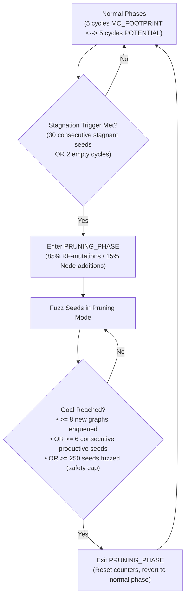

# Dynamic Performance Score Decay and Goal-Driven Graph Pruning

This document describes the design, formulas, and configuration for the **Dynamic Performance Score Decay** and **Goal-Driven Graph Pruning** mechanisms in `Main/`.

---

## 1. Dynamic Performance Score Decay

### 1.1 Motivation & Timing
In SGF, each seed has a `perf_score` that determines its priority during queue selection. Seeds that repeatedly yield no enqueued mutations should lose priority quickly, while fruitful seeds should retain their energy.

Rather than applying a static penalty upfront, decay is evaluated at **`end_skeleton_fuzzing`** (in [`src/sgf-fuzz-one.c`](../Main/src/sgf-fuzz-one.c)) based on the actual yield of that fuzzing cycle.

### 1.2 Formulation
Let a seed attempt $N_{\text{created}}$ mutations, out of which $N_{\text{added}}$ are enqueued:

1. **Yield Ratio ($r$):**
   $$r = \frac{N_{\text{added}}}{N_{\text{created}}} \quad (r \in [0.0, 1.0])$$

2. **Decay Ratio ($\text{decay\_ratio}$):**
   $$\text{decay\_ratio} = \text{clamp}\Big(\text{DECAY\_RATIO\_MAX} - r \times (\text{DECAY\_RATIO\_MAX} - \text{DECAY\_RATIO\_MIN}),\; \text{DECAY\_RATIO\_MIN},\; \text{DECAY\_RATIO\_MAX}\Big)$$

3. **Score Update:**
   $$\text{perf\_score}_{\text{new}} = \max\Big(1.0,\; \text{perf\_score}_{\text{old}} \times (1.0 - \text{decay\_ratio})\Big)$$

| Yield Scenario | Yield ($r$) | Decay Applied | Effect on `perf_score` |
| :--- | :--- | :--- | :--- |
| **Complete Failure** (0 added) | $0.0$ | **$50\%$** (`DECAY_RATIO_MAX`) | Halved immediately, deprioritizing dead seed |
| **Medium Yield** (50% added) | $0.5$ | **$27.5\%$** | Moderate reduction |
| **High Yield** (100% added) | $1.0$ | **$5\%$** (`DECAY_RATIO_MIN`) | Retains 95% of energy for future cycles |

---

## 2. Goal-Driven Graph Pruning (High RF-Mutation Phase)

### 2.1 Motivation & Mechanism
As graphs grow large during exploration, node addition mutations often produce invalid executions or fail score cutoffs. The Read-From (RF) mutation operator (`mutate_rf_edge`) disconnects reads and removes all dependent PO/RF/SW successors, **pruning overgrown graphs down to compact cores** that can branch in fresh directions.

In **`PRUNING_PHASE`**, mutation probability shifts to **85% RF-mutations / 15% Node-additions** (compared to 30% RF in `MO_FOOTPRINT` and 50% in `POTENTIAL`).

### 2.2 Clean Rollback Architecture
Because `mutate_rf_edge` prunes in-place, failed mutation attempts must not corrupt the candidate graph:
* If `try_mutate_rf` or `try_add_node` returns without a valid mutation, `reset_graph()` immediately restores `new_graph` from `original`. Fallback mutations always receive a clean graph matching simulator feedback.

### 2.3 State Machine Workflow

---

## 3. Configuration Constants (`#defines` Reference)

All operational bounds are defined in [`include/sgf-fuzz.h`](../Main/include/sgf-fuzz.h) for straightforward tuning:

| Macro | Default | Category | Description & Tuning Advice |
| :--- | :--- | :--- | :--- |
| `DECAY_RATIO_MIN` | `0.05` | Decay | **Minimum decay ratio** for seeds with 100% yield. Lower (e.g. `0.01`) to preserve high-yield seeds even longer. |
| `DECAY_RATIO_MAX` | `0.50` | Decay | **Maximum decay ratio** for seeds with 0% yield. Higher (e.g. `0.70`) to deprioritize unproductive seeds faster. |
| `STAGNANT_SEEDS_PRUNE_THRESHOLD` | `30` | Pruning Entry | **Stagnant seed count.** Consecutive non-productive seeds (0 added) needed to trigger `PRUNING_PHASE`. |
| `CYCLES_WO_FINDS_PRUNE_THRESHOLD` | `2` | Pruning Entry | **Empty cycle count.** Full queue cycles without new paths before triggering `PRUNING_PHASE`. |
| `PRUNING_TARGET_QUEUED_ITEMS` | `8` | Pruning Exit | **Corpus expansion goal.** Number of new pruned graphs added to the queue before concluding the phase. |
| `PRUNING_TARGET_PRODUCTIVE_SEEDS` | `6` | Pruning Exit | **Momentum goal.** Number of consecutive productive seeds in pruning mode before concluding the phase. |
| `PRUNING_MAX_SEEDS_SAFETY_CAP` | `250` | Pruning Exit | **Safety cap.** Maximum seeds fuzzed in pruning mode before forcing return to normal phases. |

---

## 4. Codebase Cross-Reference

| File | Responsibilities |
| :--- | :--- |
| [`include/sgf-fuzz.h`](../Main/include/sgf-fuzz.h) | Declares `PRUNING_PHASE`, threshold `#define`s, and tracking fields in `sgf_state_t`. |
| [`src/sgf-fuzz-one.c`](../Main/src/sgf-fuzz-one.c) | Tracks created/added mutations and applies dynamic `perf_score` decay at `end_skeleton_fuzzing`. |
| [`src/sgf-fuzz.c`](../Main/src/sgf-fuzz.c) | Controls `PRUNING_PHASE` entry, goal monitoring, and exit in the main fuzzing loop. |
| [`src/skeleton_graph_mutator.cpp`](../Main/src/skeleton_graph_mutator.cpp) | Implements 85% RF-mutation ratio for `PRUNING_PHASE` and `reset_graph()` rollback. |
| [`src/sgf-fuzz-queue.c`](../Main/src/sgf-fuzz-queue.c) | Sets balanced scoring weights ($\alpha = 0.5, \beta = 0.5$) for `PRUNING_PHASE`. |
| [`src/sgf-fuzz-stats.c`](../Main/src/sgf-fuzz-stats.c) | Displays `"PRUNING_PHASE"` status on the UI screen. |

---

*Ported from upstream commit `3b69c6d` ("PRUNING Phase & Dynamic Decay Ratio"), adapted to SGF's `sgf-*` file naming and `sgf_state_t` conventions.*
